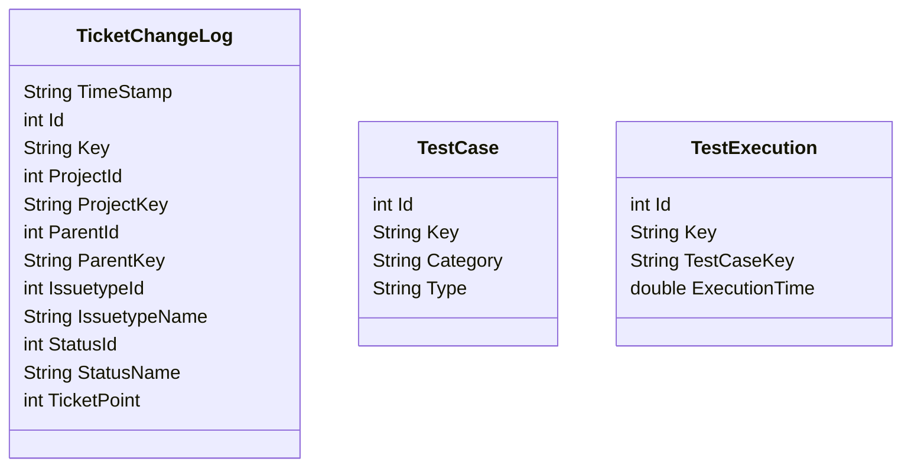

# Gologic-DevOpsMetrics
This project aim at providing a solution to aggregate data from multiple sources and to sent them into a chosen database.
The metrics that this project will focus on are related to DevOps. 
# Documentation
## Data source
### Jira
#### Metrics
- Lead time 
- Cycle time 
- Percentage of automated tests
- Health of automated tests
#### Data model

### GitHub (Coming soon)
# Contributing (Coming soon)


# Dependencies
| Name                                    | Version |
|-----------------------------------------|---------|
| Python                                  | 3.9     |

# Installation
## Create a virtual environment
``` bash
python3 -m pip install --user virtualenv
python3 -m venv env
source env/bin/activate
```

You should see in your terminal (.env) from the moment you use the command source

## Install dependencies in your virtuel environmment
``` bash
python3 -m pip install -r requirements.txt
```
# Execute the script

## Fill the configuration file
Rename config.default.cfg in config.cfg and fill it with your configurations.

## Usage 
To run the script use the following command:

```bash
python3 -p <projectkey> -t <outputtype> -o <outputfile>
```

| Input                                   | Value       |
|-----------------------------------------|-------------|
| Project key                             | String      |
| Output type                             | csv or json |
| Output file                             | String      |

If you are using Jira Server and not Jira Cloud, use the `-s` or `--server` option.