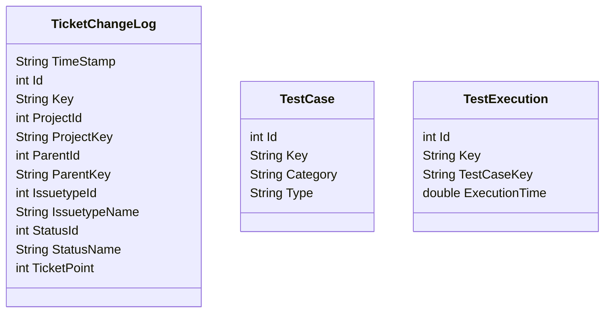

# Gologic-DevOpsMetrics

The goal of this project is to provide script collecting data 
# Config file

Rename config.default.cfg in config.cfg and fill it with your configurations.

# Usage 
Use `python -m pip install requests` to install the module.  
To run the script use the following command:  
`python3 -p <projectkey> -t <outputtype> -o <outputfile>`  
The output type can be `csv` for a csv file or `json` for a json file.  
If you are using Jira Server and not Jira Cloud, use the `-s` or `--server` option.

The project key is the 3 letters associated to a Jira Project.  
The output file will be a csv file.

